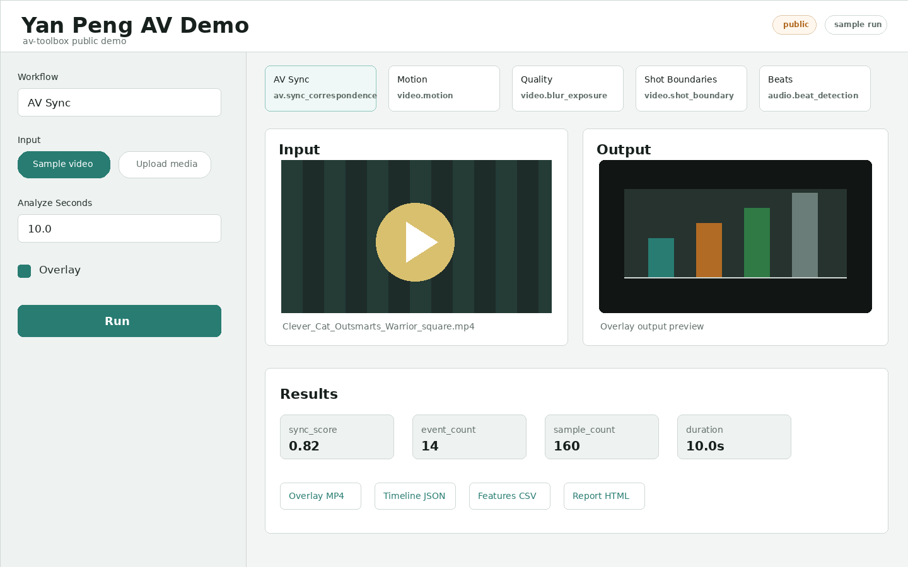

# av-toolbox

Public audio/video analysis demo powered by `av-toolbox`, Streamlit, Cloudflare
Tunnel, and a DGX Spark GPU origin.

[Open the live demo](https://demo.yan-peng.com)



## Try The Demo

1. Open <https://demo.yan-peng.com>.
2. Choose a workflow: AV Sync, Motion, Quality, Shot Boundaries, or Beats.
3. Use the sample video or upload a short non-sensitive clip.
4. Click Run, then inspect the input, output overlay, summary metrics, and
   downloadable artifacts.

The public demo keeps the input preview in place, shows the output on the right,
and places detailed results underneath. Public mode hides server filesystem paths
and exposes only bounded demo settings such as analyzed duration and overlay
export.

Please do not upload private or sensitive media to the public demo. It is a
research/demo service, not a production privacy boundary.

## What It Runs

`av-toolbox` wraps audio, video, and audio-visual analysis tools behind one
Python registry, CLI, and web UI. Current demo workflows include:

- AV Sync: match audio events to visual motion spikes.
- Motion: estimate frame-to-frame motion intensity.
- Quality: detect blur, dark frames, and overexposure.
- Shot Boundaries: find scene and cut transitions.
- Beats: detect beats, downbeats, and onsets.

## Architecture

```text
GitHub README -> https://demo.yan-peng.com -> Cloudflare Tunnel -> Streamlit on DGX Spark -> av_toolbox + GPU
```

The public URL is served through Cloudflare Tunnel. The Streamlit origin stays
bound to `127.0.0.1` on the DGX Spark host.

## Developer Docs

- [Developer README](docs/developer-readme.md): install, CLI examples, tests,
  Docker, Python API, and local web UI commands.
- [DGX + Cloudflare deployment](docs/cloudflare-demo.md): public demo mode,
  systemd service, tunnel routing, and hardening notes.
- [Tool catalog](docs/tool-catalog.md): registered tools, CLI wrappers, inputs,
  outputs, and runtime controls.
- [DenseAV setup](docs/denseav.md): optional DenseAV dependencies, checkpoint
  names, cache paths, and GPU flags.
